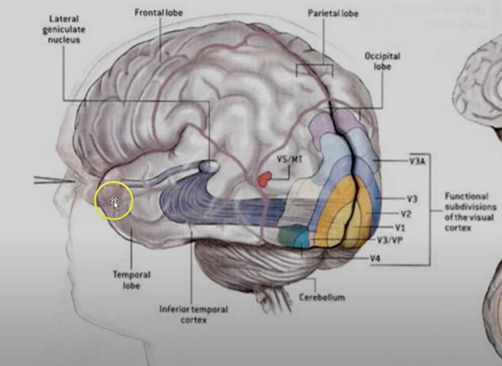

앞서서 간략하게 설명했지만 조금 더 상세하게 공부해보고 왜 필요한지에 대해서 알아보자.

# 컴퓨터 비전이란?

vision의 뜻은 시각, 시야, 눈과 같이 우리가 보고 인식함을 나타냄. 이처럼 컴퓨터 비전은 우리가 보고 인식하는 정보를 컴퓨터에서도 처리하기 위해서 필요함.

인간이나 동물들은 태어나면서부터 시각을 통한 인식을 당연시 해왔기에 이를 이해할 수 있음. 하지만 컴퓨터는 단순히 특정 풍경을 보는 것으로 이를 인식할 수 없음. 그래서 인간처럼 이를 인식할 수 있게 하기 위해서 카메라를 이용하여 데이터로 변환해주고 이를 학습시킴으로써 인식할 수 있게끔하는 분야가 컴퓨터 비전임.

# 컴퓨터 비전의 역사

컴퓨터 비전의 첫 시작은 과학자들이 고양이의 시각 피질에 전극을 넣고 빔 프로젝터로 이미지를 보여주면서 시각 피질의 뇌세포가 활성화되는 실험을 하면서 시작됨.

프로젝터를 통해서 어떤 이미지를 보여줘도 시각 피질의 뇌세포가 활성화되지 않았는데 프로젝터를 치우니까 가로 선 하나가 생겼고 이를 보는 고양이의 시각 피질이 반응을 보이기 시작함. 시각 피질의 초기층이 [DNN(Deep Neural Network)](https://www.v7labs.com/blog/neural-network-architectures-guide)의 초기층과 마찬가지로 단순한 선과 곡선에 반응을 보이는 것.

요 실험을 통해서 또 알아냈던게 시각 피질 세포들에서 서로 다른 방향의 특정 가장자리를 선호하는 것처럼 보이는 집단이 존재한다는 것. (일반적으로 뇌는 최대 활동 전위 빈도가 높은 자극들을 선호, https://claude.ai/chat/73a16a04-24a6-49a9-bb26-0ce6a1c4f17d)

⇒ 서로 다른 세포들은 서로 다른 자극을 선호하는데 모두 한 방향 혹은 다른 방향의 가장자리에 반응.

시각 처리의 초기 단계는 시각적 세계를 다양한 방향의 가장자리로 분해하는 것처럼 볼 수 있음.

### 인간의 시각 처리 단계

인간의 시각 경로를 알아보자.

먼저 인간의 눈을 통해서 빛의 전기 신호가 들어오면 이게 망막에 부딪힘. 망막은 빛에 민감한 2차원 시트라고 생각하면 되고 요 전기 신호를 망막에 연결된 시신경을 통해서 시상으로 보내고 여기서 시각 피질로 신호를 보냄. 시상에는 시냅스들이 있고 축삭을 통해서 시각 피질과 연결. 시각 피질은 위 사진처럼 다양한 영역이 있는데 그 중 V1 영역이 이 전기 신호를 입력 받음.

### 망막의 앞 부분

망막에 상을 맺히게 하기 위해서 그 앞단에 존재하는 각막, 홍채, 수정체에 대해서 알아보자.

각막은 카메라의 앞에 유리와 같은 역할을 수행. 이를 통해서 눈을 보호하고 빛을 모아주는 역할을 수행.

홍채는 동공의 크기를 조절하는 녀석이고 빛의 양을 조절하는 역할을 수행. 카메라에서 조리개의 역할.

수정체는 눈의 안쪽에서 빛을 굴절시켜서 망막에 상이 맺히게 하는 녀석으로 초점을 조절함. 카메라에서 렌즈의 역할을 수행함. 멀리 봐야하면 초점이 멀어져야 하고 이때는 수정체가 얇아지고 가까워져야 하면 두꺼워짐. (볼록렌즈) 그래서 할머니들이 돋보기 안경(볼록렌즈)를 끼는 경우가 가까운 글씨를 볼 때 수정체를 조절하는 근육이 약해져서 더 두껍게 못만드니까 이를 이용하는거임.

### 망막

망막은 카메라의 필름과 같은 기능을 수행.

망막을 2차원 시트라고 명명하는 이유는 눈의 뒤쪽에 평평하게 펼쳐져있고 깊이보다는 높이와 너비의 측면(2D)에서 기능함. 마치 스크린에 이미지를 표현하는 것처럼 평평하게 펼쳐져서 빛의 신호를 받고 이를 전기 신호로 바꿈.

여기서 높이와 너비의 측면에서 동작한다는 의미가 깊이 즉, 거리에 대한 정보를 전기 신호로 변환하지 못한다는 의미이고 그래서 눈이 2개 필요한 이유기도 함.

양안 시차를 이용하여 거리를 측정 → 눈 사이의 거리와 두 눈에서의 약간 오프셋된 이미지들을 비교해서 이미지간의 각도를 계산하고 이를 이용하여 삼각 측량해 거리계산.

### 시상

시상에 위치한 핵은 수용체(눈, 혀, 귀 등)으로 부터 감각정보를 받아들여서 대뇌 피질로 전달하는 역할. 시각은 시상의 외측슬상체를 통해서 대뇌피질로 전달됨.

### 시각피질

저 변환된 데이터들이 시각피질로 전달되는데 시각피질에는 여러 layer가 존재함. 이를 subvision이라고 부르고 각 레이어를 거칠 떄마다 더 복잡하고 디테일한 형상을 인식하기 위한 computation이 동작함.

V1에서는 단순히 특정 방향의 edge들에 집중하고 인식하는데 다른 subvision들부터는 복잡한 윤곽과 움직임, 깊이, 거리 등의 데이터를 얻기 위해 뉴런들이 동작함.

# Reference

https://www.v7labs.com/blog/what-is-computer-vision

https://www.youtube.com/watch?v=QsikPDDxy4g