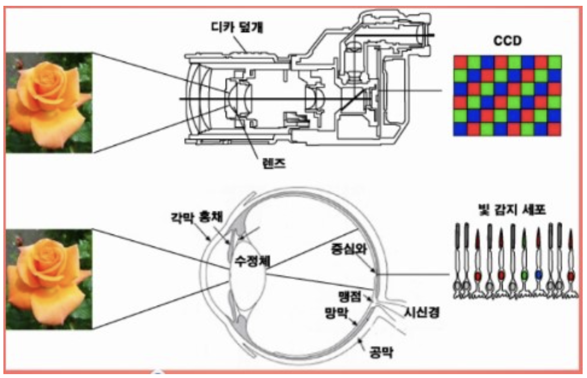

인간의 눈이 시각 정보를 통해서 물체를 인식하기 위한 그 과정들을 볼 때 눈의 어떤 부위들이 카메라의 어떤 부품과 매핑되는지를 살펴보았음. 그렇다면 카메라는 어떻게 빛을 저장할까??

# 필름 카메라

필름 카메라는 들어오는 빛을 거울을 통해서 프리즘에 넣고 뷰 파인더로 보내서 눈으로 확인하는 구조이고 셔터를 누르면 거울이 올라가면서 빛의 상이 필름에 남게 되는 구조. 필름에는 화학물질이 발려져 있어서 빛과 만나게 되면 화학반응을 일으켜 상을 저장. 그리고 이를 현상하게 되면 이미지를 확인하는 구조.

# 디지털 카메라

디지털 카메라는 간단하게 필름 카메라의 필름 부분을 센서로 대체한 것이라 생각하면 됨. 
### 색 인식

사람이 색을 인식하기 위해서 원뿔 세포를 이용하고 명암을 막대 세포를 이를를 이용. 
디지털 카메라에서 영상 표현 장치를 구성하는 최소 단위를 픽셀이라고 함 -> 하나의 픽셀는 인간의 세포처럼 빨강색, 파랑색, 초록색 3개 값을 가짐. 
인간은 그림의 세포들을 이용해서 빛에서 색상을 인식하고 카메라는 각 픽셀마다 하나의 색상 필터를 배치하여 색상 정보를 뽑아냄. (RGB) 
=> image를 numpy ndarray로 변환했다고 가정하면 RGB 포맷이라면 3차원 array로 저장될 것이고 각 인덱스의 값은 픽셀의 색상에 대한 값. 

# Reference
https://blog.naver.com/wndrlf2003/220248457050