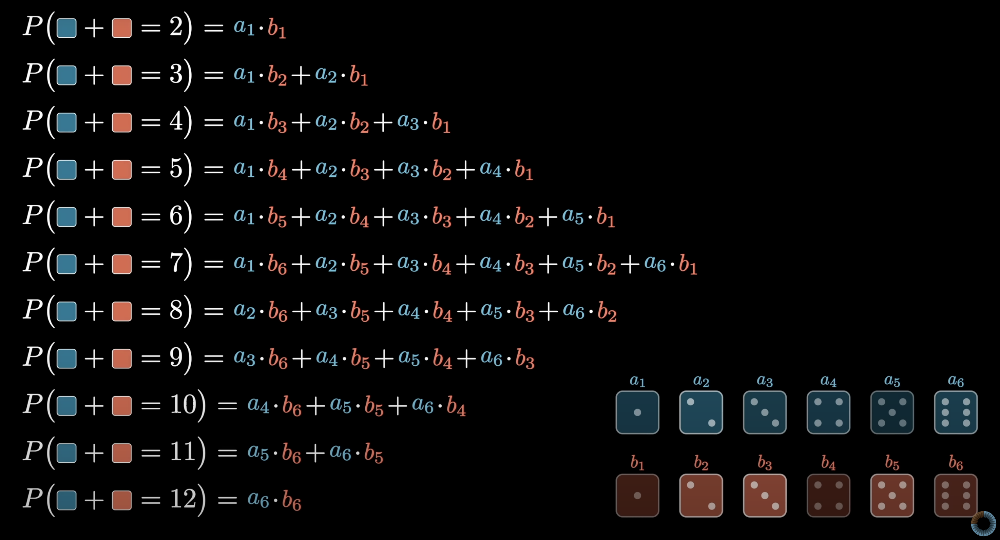

# 컨볼루션이란?
컨볼루션은 한국어로 합성곱이라고 표현하고 기존 대수에서와는 다른 새로운 연산 규칙을 말함. -> 이는 곱셈과 적분으로 이루어져 있음. 
그래서 미분이랑 적분을 이해하고 다시 컨볼루션이 뭔지 알아보자.
### 미분
수학적으로 미분을 계산하는 방법은 차수를 식에 곱하고 차수에서 1을 뺌. 
여러 식이 더해져있는 경우에는 각각의 식에 대해서 차수를 식에 곱하고 차수에서 1을 뺌. 
=> 이렇게 나온 식이 어떤 의미? -> 이는 그래프의 접선 기울기를 나타냄. (이를 이용해서 접선의 방정식도 알아낼 수 있음.)
### 적분
수학적으로 적분을 계산하는 방법은 미분을 거꾸로 함.  
차수에 1을 더하고 해당 차수 값으로 식을 나누면 됨. 근데 상수로 어떤 값이 있었는지 알 수 없으니까 적분상수(C)를 더함.  
=> 이렇게 나온 식이 어떤 의미? -> 이전 그래프와 특정 축으로 둘러쌓인 공간의 넓이를 나타냄. -> 특정 구간의 넓이를 구하는 행위를 정적분이라 표현.  

### 합성곱
두 함수를 결합하여 세번째 함수를 생성하는 연산. -> image processing에서는 입력 이미지 데이터와 커널(필터)를 결합해서 이미지를 변환.
=> 세번째 함수를 만드는데 어떤 함수를 만드는 건지 그리고 어떠한 연산들을 수행하는지.

- 합성곱이 뭔지 생각할 수 있는 근본적인 방법
- 2개의 주사위의 합이 특정 값이 되는 확률을 구하기 위해서 1부터 6까지 나열하고 한 쪽 주사위는 뒤집어서 이를 슬라이딩하면서 확률을 구해보니 a1*b6 + a2*b5 + .... + a6*b1와 같은 형태의 식으로 나타낼 수 있음.
- 하나의 값 목록인 a와 다른 하나의 값 목록인 b를 결합해서 값을 얻었음. -> 이를 두 배열의 합성곱이 우리에게 새로운 11개의 값을 가진 배열을 제공한다고 말함. -> 각각은 쌍들의 곱의 합처럼 보여짐.

- 이는 요렇게 격자로 나타냈을 때 행과 열의 값을 곱하고 그 대각선 인덱스의 값들을 더하는 것과 같음.

- 수식으로 표현해보자면 요런 식으로 표현가능. 
- 합성곱의 n번째 요소는 i, j 합성곱을 하는 각 목록의 i, j번째 요소의 곱들의 합과 같고 i와 j를 더하면 n이 되어야함.
- 즉, n=6이면 (1*5) + (2*4) + (3*3) + (4*2) + (5*1) 이런 식.

- 위의 수식은 요렇게 표현 가능.

- 이제 moving average라는 예시를 한번 보자.
- 첫 번째 배열에는 0과 1이 특정 구간에서 반복되는 값을 가지고 다른 배열은 0.2의 값이 5개 존재하고 합이 1이 되는 배열.
- 두 배열을 합성곱하면 어떻게 될까?? -> 결국은 첫 번째 배열의 각 인덱스에 1/5를 곱하고 더하는 거임 -> 이거는 평균인데 그 이유는 각 값을 다 더하고 개수의 길이로 나누는 것과 같음.
    - (1+2+3+4+5)/5 == (1/5 + 2/5 + 3/5 + 4/5 + 5/5) => 분배법칙: a(b + c) = ab + ac

- 그래서 결국 이 컨볼루션은 데이터의 평균을 의미하는 새로운 배열을 만들어냄. -> 그렇게 된다면 기존 데이터보다 좀 더 부드러운 그래프를 그리게 될꺼임.

- 만약 슬라이딩 커널(필터)의 합은 1로 고정을 하고 (0.1, 0.2, 0.4, 0.2, 0.1)로 수정을 한다면?? -> 똑같이 더 부드러운 그래프를 그리지만 중앙값에 더 많은 가중치를 부여함.

- 이를 2차원 이미지 데이터에 적용하게 된다면 이미지를 블러 처리하게 됨.

- 각 픽셀의 rgb 벡터에 1/9를 곱하고 이를 전부 더하면 아래와 같이 각 색상들의 평균이 되기 때문에 흐리게 보이게 되는 것.

- 그래서 이 결과 이미지를 원본 이미지와 1/9 3x3 2차원 배열의 합성곱이라고 부름.

- 더 정확히는 작은 격자를 180도 뒤집은 격자와의 컨볼루션 -> 주사위 슬라이딩할 때 본 것처럼 뒤집어줘야함.

- 요런 식으로 해당 격자에서는 중앙 값이 더 큰 비중을 가지는데 이 격자가 어디서 왔냐면 가우시안 분포로 알려진 종형 곡선을 이용하는 거임.
- 해당 커널(필터)를 이용해서 흐리게 만드는 방법을 가우시안 블러라고함.

- 다른 방법들을 찾아보자. -> 위와 같은 커널을 이용하여 합성 곱을 할 것인데 첫번째 열이 파란색, 마지막 열이 빨강색을 색칠한다고 생각.
- 그래서 흑백인 이미지를 가정하고 해당 합성 곱 -> 그레이 스케일이니까 RGB가 아닌 채널이 1개임.
- 합성 곱의 값이 음수면 빨강색 양수면 파랑색으로 색칠 -> 근데 해당 격자가 모두 같은 색깔 위에 있을 때는 값의 합이 0이니까 검정색이 됨.

- 그니까 격자가 다 같은 색상을 가지지 않는 곳 (픽셀 값의 변화가 있는 곳) -> 세로축이라고 볼 수 있음. -> 격자의 크기를 세밀하게 조정한다면 더 명확하게 가져올 수 있을 듯.
- 이 대비되는 곳을 첫번째 행과 마지막 행으로 변경하면 가로축을 판단할 수 있음.
 
- 이런 연산은 O(N^2)의 시간 복잡도를 가짐. -> 이를 더 빠르게 해주기 위해서 FFT(Fast Fourier Transform)이란 방법이 있는데 이를 위해선 (DFT, 이산 푸리에 변환)을 이해하면 좋을 것 같음. -> FFT 알고리즘을 이용하면 N^2를 NlogN으로 줄여줌 
- 그래서 더 빠르게 합성곱을 찾으려면 합성곱을 하려는 두 값을 FFT를 해서 특정 계수를 구하고 이 계수를 곱해서 Inverse FFT를 하면 합성곱 값이 나옴. -> Fast Convolution Algorithm

# Reference
- https://www.youtube.com/watch?v=NHxr1P5D0Aw
- https://www.youtube.com/watch?v=KuXjwB4LzSA

