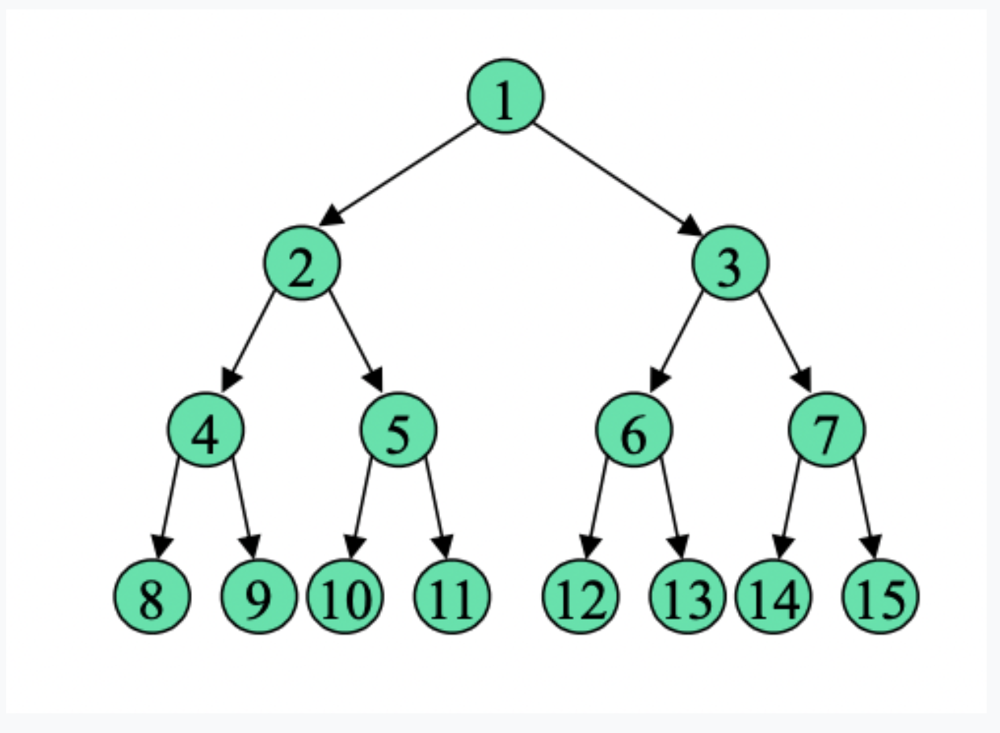
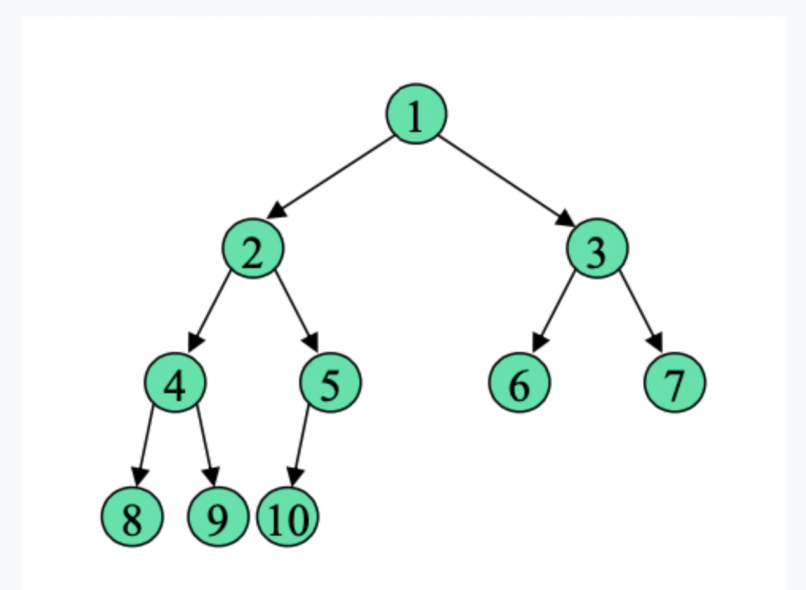

# Heap
- 최대/최소 힙 존재. -> root에 어떤 값을 둘건지.
- Heap은 완전 이진 트리라는 성질을 가짐.
    - 이진 트리, 완전 이진 트리, 포화 이진 트리
        - 이진 트리는 각 노드의 자식이 2개 이하인 트리 구조를 뜻함. -> 이외의 성질 및 규칙은 없음.
        - 포화 이진 트리(Full BT)는 leaf node level까지 전부 꽉찬 이진 트리를 뜻함.
            
        - 완전 이진 트리(Complete BT)는 새로운 노드 삽입을 leaf node level에서 맨 왼쪽부터 하고 leaf node level을 제외하고 Full BT인 이진 트리를 뜻함. 
            
## Heap vs 이진 탐색 트리(BST)
- 두 자료구조는 목적이 다름. -> Heap은 최대/최소 값을 찾기 위함. 이진 탐색 트리는 정렬된 데이터를 저장하기 위함.
- 그래서 Heap은 최대/최소 값을 루트에 저장해서 최대/최소 값을 찾으려면 O(1)인데 특정 값을 찾으려면 O(N)임.
- 근데 BST는 특정 값의 탐색, 삽입, 삭제가 O(logN)임.
- 그럼 특정 기준으로 정렬된 데이터를 출력하는 시간복잡도는? -> 둘 다 O(NlogN)임.
    - Heap은 루트를 제거하고 다시 정렬하는데 O(logN)이고 모든 루트 값을 제거해야 하니까 O(NlogN)
    - BST는 모든 정렬된 데이터의 위치를 쿼리하려면 O(N)이고 데이터 위치를 찾을 때 O(logN)이라서 O(NlogN)
## Heap 코드
- 직접 slice 이용해서 구현하기
- 실질적으로 slice를 변경을 가하는 Push, DeleteMax 함수에서만 포인터 리시버를 이용.
- upHeap, downHeap 같은 함수들에서 bt level별 함수 실행을 위해 재귀함수 이용.
```go
/*
	- heap 직접 구현함으로써 이해하기
	- 일반적으로 힙을 이용하여 정렬할 때 많이 사용하고 우선순위 큐 자료구조를 이용하여 구현함.
	- Less 조건 수정 시 MinHeap 구현 가능
*/

package main

import "fmt"

type Heap []int

func NewHeap() *Heap {
	return &Heap{0}
}

func (m Heap) Print() {
	for i := 1; i <= m.Len(); i += 1 {
		fmt.Printf("%d ", m[i])
	}
}

func (m Heap) Less(sIndex int, tIndex int) bool {
	return m[sIndex] < m[tIndex]
}

func (m Heap) Len() int {
	return len(m) - 1
}

func (m Heap) IsEmpty() bool {
	return m.Len() == 0
}

func (m Heap) Peek() (int, error) {
	if m.Len() == 0 {
		return 0, fmt.Errorf("Heap is empty")
	}
	return m[1], nil
}

func (m Heap) GetParent(now int) int {
	return int(now / 2)
}

func (m *Heap) Push(num int) int {
	*m = append(*m, num)
	nowIndex := m.Len()
	parent := m.GetParent(nowIndex)
	return m.upHeap(parent, nowIndex)
}

func (m Heap) upHeap(pIndex int, nIndex int) int {
	if pIndex >= 1 && m.Less(pIndex, nIndex) {
		m.swap(pIndex, nIndex)
		nIndex, pIndex = pIndex, m.GetParent(pIndex)
		return m.upHeap(pIndex, nIndex)
	}
	return nIndex
}

func (m Heap) swap(tIndex int, sIndex int) {
	m[sIndex], m[tIndex] = m[tIndex], m[sIndex]
}

func (m *Heap) DeleteMax() (int, error) {
	if m.IsEmpty() {
		return 0, fmt.Errorf("Empty heap can't delete max")
	}

	mInt := m.pop()
	m.downHeap(1)
	return mInt, nil
}

func (m *Heap) pop() int {
	m.swap(1, m.Len())
	old := *m
	mInt := old[m.Len()]
	*m = old[0:m.Len()]
	return mInt
}

func (m Heap) downHeap(nIndex int) {
	if m.Len() < nIndex {
		return
	}

	if lChildIndex, err := m.GetLeftChildIndex(nIndex); err == nil && m.Less(nIndex, lChildIndex) {
		m.swap(nIndex, lChildIndex)
		m.downHeap(lChildIndex)
	}
	if rChildIndex, err := m.GetRightChildIndex(nIndex); err == nil && m.Less(nIndex, rChildIndex) {
		m.swap(nIndex, rChildIndex)
		m.downHeap(rChildIndex)
	}
}

func (m Heap) GetLeftChildIndex(nIndex int) (int, error) {
	lChildIndex := nIndex * 2
	if m.Len() < lChildIndex {
		return 0, fmt.Errorf("Not present left child")
	}
	return lChildIndex, nil
}

func (m Heap) GetRightChildIndex(nIndex int) (int, error) {
	rChildIndex := nIndex*2 + 1
	if m.Len() < rChildIndex {
		return 0, fmt.Errorf("Not present right child")
	}
	return rChildIndex, nil
}

func main() {
	var n int
	fmt.Scanln(&n)

	m := NewHeap()
	for i := 0; i < n; i++ {
		var num int
		fmt.Scanf("%d", &num)
		m.Push(num)
	}
	fmt.Print("Initialize: ")
	m.Print()
	fmt.Println()

	for {
		if p, err := m.Peek(); err == nil {
			fmt.Println("Peek: ", p)
		}

		mInt, err := m.DeleteMax()
		if err != nil {
			break
		}

		fmt.Println("Delete: ", mInt)
		fmt.Println()
	}
}

```
- 우선순위 큐 자료구조 이용해서 구현하기 -> 시간복잡도의 효율성은 없음
    - pop 시에 새로운 배열을 만드는게 아니라 슬라이싱을 이용해서 기존 슬라이스의 뷰를 이용하기 때문에 O(1)임
- 근데 구현 시간이나 표준 라이브러리를 이용했을 때의 최적화, 가독성과 같은 부분에서의 이점이 있는 것
- 확실히 간결하긴함.
```go
package main

import (
	"container/heap"
	"fmt"
)

type MaxHeap []int

func (m MaxHeap) Len() int           { return len(m) }
func (m MaxHeap) Less(i, j int) bool { return m[i] > m[j] }
func (m MaxHeap) Swap(i, j int)      { m[i], m[j] = m[j], m[i] }

func (m *MaxHeap) Push(x interface{}) {
	*m = append(*m, x.(int))
}

func (m *MaxHeap) Pop() interface{} {
	old := *m
	mValue := old[m.Len()-1]
	*m = old[0 : m.Len()-1]
	return mValue
}

func main() {
	var n int
	fmt.Scanln(&n)

	h := &MaxHeap{}
	for i := 0; i < n; i++ {
		var num int
		fmt.Scanf("%d", &num)
		heap.Push(h, num)
	}

	for {
		if h.Len() <= 0 {
			break
		}
		fmt.Printf("%d ", heap.Pop(h))
	}
}

```

## 왜 Heap을 찾아보았는지
- https://www.codetree.ai/missions/4/problems/leftmost-max-value/description
- 위 문제를 풀 때, O(N^2)인 알고리즘으로 풀었는데 만약 N이 최대 1,000,000인 경우 풀 수 있을까를 보기 위해서 Heap을 찾아봄.
- 결론은 Heap으로는 풀 수 없음. -> Heap의 목적은 최대/최소 값을 찾기 위함임.
    - 근데 위 문제는 최대 값과 그 위치 정보가 필요하고 데이터가 계속 변해야함. -> Heap은 적합한 자료구조가 아님.
    - 위치 정보를 같이 저장해도 최대값이 여러 개인 경우 맨 왼쪽 최대 값을 찾긴 어려움.
- 위 문제를 내가 가정한 range에서 풀려면 세그먼트 트리를 이용해야함. -> 해당 자료구조에 대한 문서 만들것.
