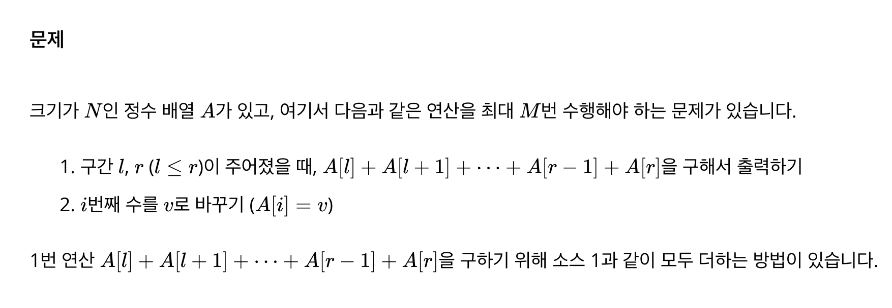
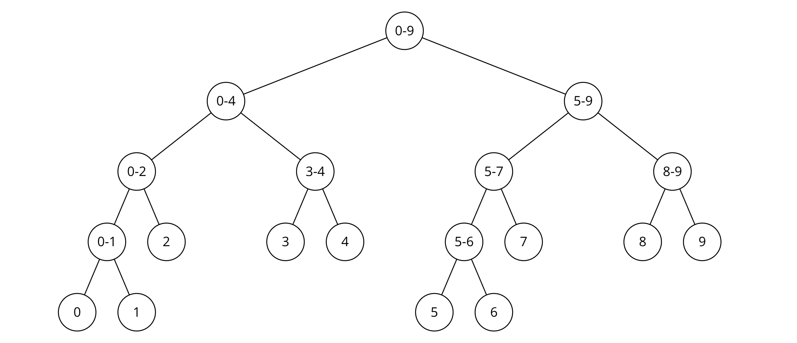
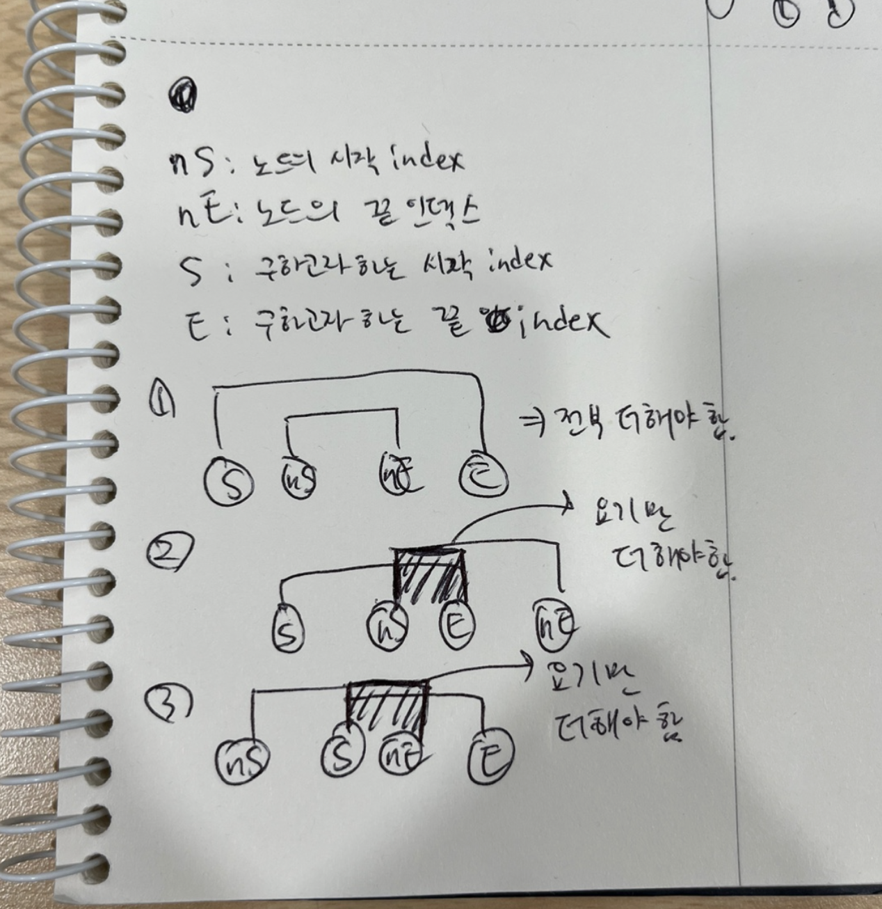

# Segment tree
- Segment: 부분, 분할, 세부부분 등
- 세그먼트 트리는 배열의 간격, 세그먼트에 대한 조회 및 갱신의 효율성을 위한 자료구조입니다.
- 특정 범위, 구간의 값을 이용한 연산(합, 최솟값, 최대값 등)의 효율성을 높이기 위해서 주로 사용합니다.
## 필요성
아래와 같은 문제에서 일반적인 for문을 사용했을 때 특정 구간의 합을 구하기 위해서 O(N), 값의 갱신을 위해 O(M)이란 시간복잡도를 가집니다. 누적합을 이용한다고 해도 특정 범위의 연산 결과를 구할 때는 O(1)이지만 값을 갱신하고 누적합을 다시 갱신할 때 O(NM)을 소요합니다.
  
만약 세그먼트 트리를 이용한다면 구간(세그먼트)에 대한 연산과 갱신을 O(logN)의 시간복잡도로 처리할 수 있습니다.  
## 세그먼트 트리란?
- 한마디로 노드의 범위 데이터를 저장하는 트리입니다. -> 그럼 노드의 범위 데이터가 무엇일까요?  
  
- 위의 사진에서 알 수 있는 것은 리프 노드는 하나의 인덱스에 대한 값을 가지지만 리프 노드를 제외한 노드들은 특정 범위와 같은 숫자들을 가지고 있는 것을 확인할 수 있습니다.
- 이런 특정 범위에 대한 특정 연산의 결과를 리프 노드를 제외한 노드들에 저장합니다. -> 실제 인덱스에 들어있는 값은 리프노드지만 구간에 대한 값을 외의 노드에서 저장해야 하니까 더 많은 저장 공간을 이용합니다. -> 총 10개의 인덱스를 가진 배열에 대해서 세그먼트 트리를 만든다면 노드의 개수가 몇개가 되어야 할까요?
    - 세그먼트 트리는 리프 노드를 제외한 모든 노드들이 자식 2개를 모두 가져야합니다. -> Full Binary Tree
        - 그럼 세그먼트 트리의 높이는 리프노드 개수가 2의 거듭제곱인 경우 -> log2N
        - 리프노드의 개수가 2의 거듭제곱이 아니면 -> 내림(log2N) + 1
    - 총 노드의 개수는 모든 레벨의 노드의 수를 더하면 나오고 이를 표현해보면 2^0 + 2^1 + 2^2 + ... + 2^(h-1)이 됩니다.
    - 이는 등비수열이고 이 수열의 합을 공식( a(rn - 1) / (r - 1) )을 이용해서 표현해보면 1(2^h - 1) = 2^h - 1이 됩니다.
    - 리프노드가 n개일 때의 레벨이 2^(h-1)이고 이는 2^(h-1) = n으로 표현 가능합니다. => 두 항에 각각 2를 곱하면 2n = 2^h가 됩니다.
    - 그럼 최종적으로 Sn(총 노드의 개수) = 2n(리프 노드의 개수) - 1이 됩니다.
- 세그먼트 트리에서 사용할 수 있는 연산은 이진 및 연관 연산입니다.
    - 이진 연산: 두 개의 피연산자를 받아 하나의 결과를 만드는 연산.
        - 각 노드가 두 개의 자식 노드를 이용한 결과가 되어야 하기 때문.
    - 연관 연산: 연산의 순서를 바꿔도 결과가 같은 연산. 즉, (a ∘ b) ∘ c = a ∘ (b ∘ c)가 성립하는 연산입니다. 여기서 ∘는 임의의 연산을 나타냅니다.
        - 쿼리 처리 시 여러 노드의 정보를 결합 시, 연산의 순서가 결과에 영향을 주지 않아야 하기 때문.
## 세그먼트 트리의 응용 분야:
- 간격 스케줄링:  세그먼트 트리는 약속 스케줄링이나 리소스 할당과 같이 겹치지 않는 간격을 효율적으로 스케줄링하는 데 사용할 수 있습니다.
- 범위 기반 통계:  세그먼트 트리는 분산, 표준 편차, 백분위수와 같은 범위 기반 통계를 계산하는 데 사용할 수 있습니다.
- 이미지 처리:  세그먼트 트리는 이미지 처리 알고리즘에서 색상, 질감 또는 기타 속성을 기준으로 이미지를 세그먼트로 나누는 데 사용됩니다.
## 세그먼트 트리 구현해보기
- ING/code_practice/datastructure/segment.go (segment_tree_run.go로 실행)
- 세그먼트 트리 중요 logic
    1. 세그먼트 트리 initialize
        - 세그먼트 트리를 초기화할 때 리프 노드에는 배열의 값들이 들어가게 만들고 그 리프 노드들의 부모 노드에는 합이나 최대값과 같은 특정 연산의 결과를 저장합니다.
        - 이를 위해서 재귀 함수를 이용. -> 리프 노드라면 배열의 값을 넣게 구현하고 그게 아니라면 linking된 child node의 value를 합하도록 구현합니다.
    2. 세그먼트 트리 구간합
        - 여기서는 구하고자 하는 구간과 노드의 구간을 비교했을 때 크게 4가지 경우가 가능합니다.
              
            1. 노드의 구간이 구하고자 하는 구간의 내부에 포함되는 경우
                - 이 경우는 해당 노드의 구간이 모두 필요합니다. -> 그니까 노드의 value를 return합니다.
            2. 노드의 구간에 구하고자 하는 구간의 끝 범위만 포함되는 경우
                - 이 경우는 노드의 시작 범위부터 구하고자 하는 구간의 끝 범위까지만 필요합니다. -> (노드의 시작 범위, 구간의 끝 범위)를 이용해서 재귀를 돌립니다.
            3. 노드의 구간에 구하고자 하는 구간의 시작 범위만 포함되는 경우
                - 이 경우는 구하고자 하는 구간의 시작 범위부터 노드의 끝 범위까지만 필요합니다. -> (구간의 시작 범위, 노드의 끝 범위)를 이용해서 재귀를 돌립니다.
            4. 노드의 구간과 구하고자 하는 구간이 아예 겹치지 않는 경우
                - 이건 아예 필요없으니까 연산이 이루어져도 상관없는 0을 반환합니다.
    3. 세그먼트 트리 갱신
        - 해당 연산은 특정 리프 노드의 값을 바꾸고 이와 관련이 있는 구간합의 노드들만 갱신시킵니다.
            - 재귀를 이용해서 특정 노드가 리프노드이고 i랑 index가 같다면 노드의 value를 갱신합니다.
            - 그리고 만약 해당 index가 range에 포함된다면 노드의 value를 다시 자식들의 value의 합으로 갱신합니다.

